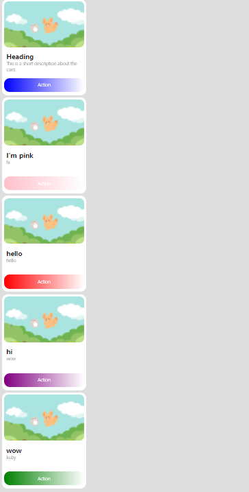
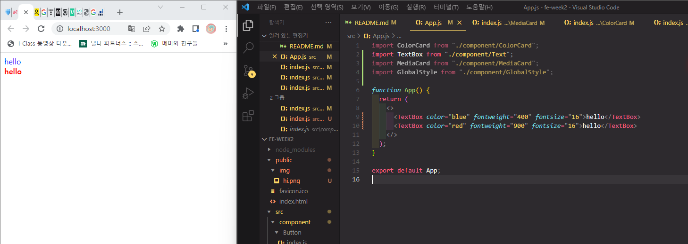
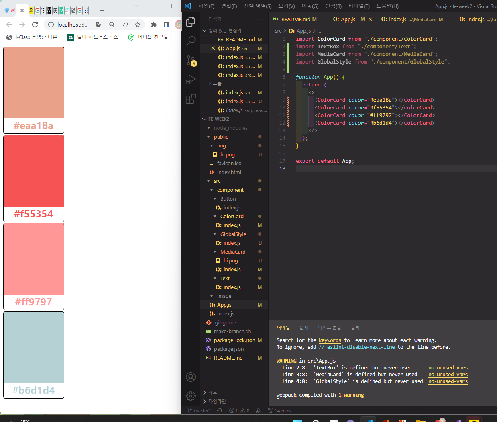
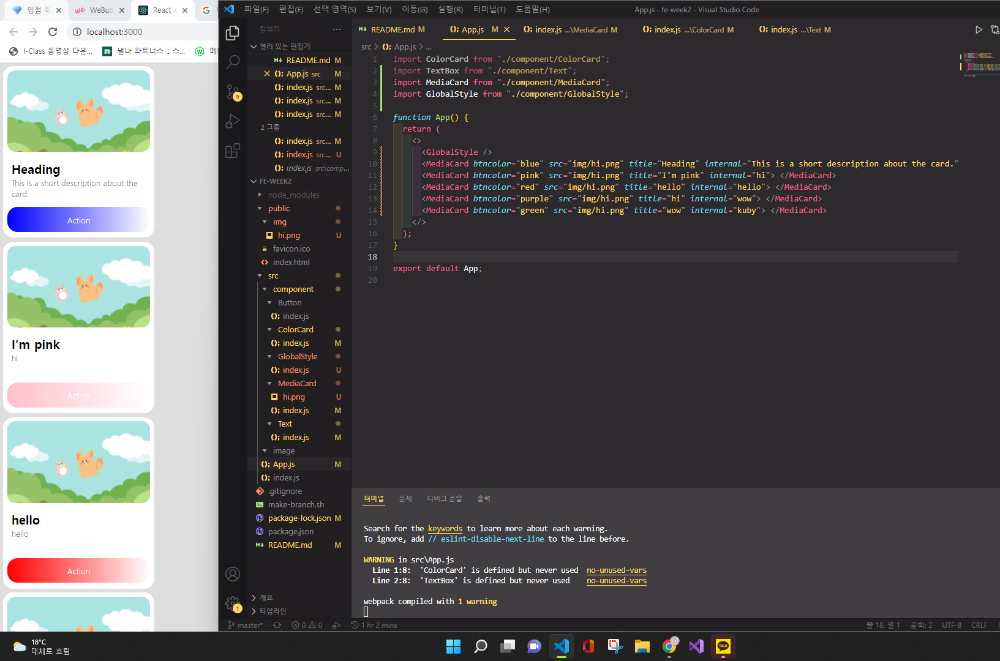

<<<<<<< HEAD
      
=======
# 리뷰

# 1번 문제

---

- 원하는 태그를 직접 만들기
    1. src/component/원하는태그이름폴더 생성 (이름은 대문자로 시작해야한다~)
    2. index.js파일 만들기 
    3. 원하는대로 만든다. css처럼 작성하면 된다. (객체를 만든다고 생각하면 되지않을까)
    
    ```jsx
    import React from "react"; 
    import styled from "styled-components";
    
    const StyledButton = styled.button` //이미 만들어진 button태그를 상속받아 내가 새로운 태그를 만든다 
    	height: 50px;  //내가 만드는 태그를 꾸미는 것
    	color: ${(props) => (props.color? props.color : "black")};
    	//etc...
    `;
    
    const Button = (props) => {
    	return(
    		<StyledButton color={props.color}>
    			{props.children}
    		<StyledButton>
    	);
    };
    
    export default Button; //대문자로 시작해야한다~
    ```
    
- 내가 만든 태그 직접 사용하는 법
    1. import한다. (이때 경로를 잘못쓰는 것에 주의할 것)
    2. 기존의 태그처럼 사용하면 된다. 
    3. 필요시 속성도 작성한다. 입력받은 값은 props.속성 → 꾸미는 곳으로 이동
    
    ```jsx
    import TextBox from "./component/Text";
    
    function App() {
    	return(
    		<> //return을 한꺼번에 묶어주는 태그가 없다면 <></>를 사용해 묶어줘야한다.
    			<TextBox color="blue" fontWeight ="400" fontSize="16">hello<TextBox>
    			<TextBox color="blue" fontWeight ="400" fontSize="16">hello<TextBox>
    		</>
    	);
    };
    
    export default App;
    ```
    
    - blue = argument, props.color = parameter 라고 생각하자. 인자를 전달해주고 const StyledButton에 들어가 값들이 사용되는 것이다.



# 2번 문제

---

- 내가 만든 태그를 내가 만든 또다른 태그에서.. 사용하기
    1. import한다.
    2. return 안에 작성하면 너무나 간단하게 사용할 수 있다.
    
    ```jsx
    import React from "react";
    import styled from "styled-components";
    import TextBox from "../Text"; //만들어놨던 태그 설치
    
    const CardWrapper = styled.div`
      border-radius: 3%;
      width: 300px;
      height: 430px;
      border: 1px black solid;
      text-align: center;
      margin: 5px;
      
    `;
    
    const ColorWrapper = styled.div`
      border-top-left-radius: 3%;
      border-top-right-radius: 3%;
      height: 350px;
      border: 1px solid ${(props) =>
        props.color ? props.color : "black"};;
      background-color: ${(props) =>
        props.color ? props.color : "white"};
      
    `;
    
    const ColorCard = (props) => {
      return (
        <CardWrapper>
          <ColorWrapper color={props.color}/>
          <TextBox fontweight="550" color={props.color}>{props.color}</TextBox>
        </CardWrapper>
      );
    };
    
    export default ColorCard; 
    ```
    
- 태그를 사용하는 App.js에서 props를 넘겨주자
    
    ```jsx
    //...
    
    function App() {
    	return(
    		<>
    			<ColorCard color="#eaa18a"></ColorCard>
    			<ColorCard color="#f55354"></ColorCard>
    		</>
    	);
    };
    
    //...
    ```
    
    #eaa18a, #f55354가 넘겨준 props다
    
      

# 3번 문제

---

- 계층 구조를 잘 만들자
    1. 문제를 보고 무엇이 무엇을 감싸고있는지를 잘 확인하여 만드는 것이 중요하다.
    2. 해당되는 요소들은 Wrapper로 이름붙여서 작성해준다.
    
    ```jsx
    import React from "react";
    import styled from "styled-components";
    import TextBox from "../Text";
    
    const PhotoWrapper = styled.div`
      background-image: url(${(props) => (props.src ? props.src : "none")});
      background-size: cover;
      border-radius: 20px;
      height: 200px;
      //
    `;
    const TextWrapper = styled.div`
    
    margin-top: 10px;
    margin-bottom: 10px;
      padding: 10px;
      height: 95px;
      //
    `;
    const ButtonWrapper = styled.div`
    border-radius: 25px;
    padding: 17px 17px;
    text-align: center;
    background: linear-gradient( to left, rgba(255, 255, 255, 0.1), ${(props) => (props.btncolor ? props.btncolor : "white")});
    
      //
    `;
    const Main = styled.div`
    padding: 10px;
      background-color: white;
      width: 350px;
      height: 400px;
      border-radius: 25px;
      margin-bottom: 10px;
      //
    `;
    
    const MediaCard = (props) => {
      return (
        <>
        <Main>
          <PhotoWrapper src={props.src}>
          </PhotoWrapper>
          <TextWrapper>
            <TextBox fontsize="30px" fontweight="800">
              {props.title}
            </TextBox>
            <TextBox fontsize="20px" fontweight="200" color="grey">
              {props.internal}
            </TextBox>
            </TextWrapper>
          <ButtonWrapper btncolor={props.btncolor}>
            <TextBox fontsize="20px" color="white">Action</TextBox>
          </ButtonWrapper>
        </Main>
        </>
      );
    };
    
    export default MediaCard;
    ```
    

**구조**

- main
    - PhotoWrapper
    - TextWrapper
        - TextBoxs
    - ButtonWrapper
        - TextBoxs

      


>>>>>>> master
